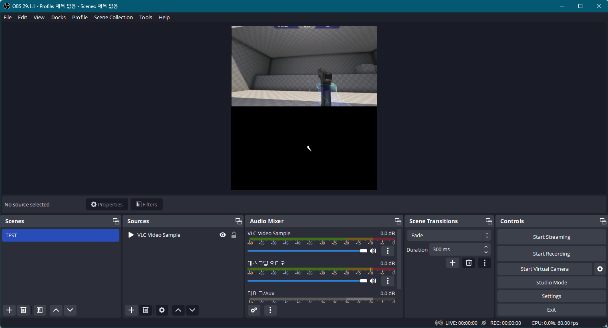
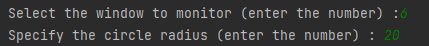
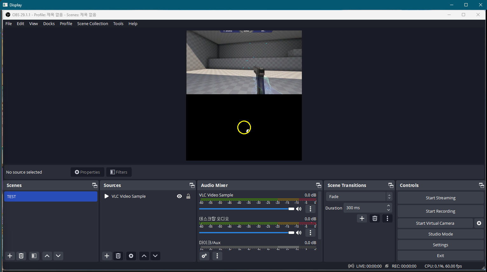
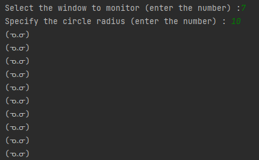

# Azusa Detector (ᓀ‸ᓂ)
Q : quit<br>
R : record<br>
M : mute

pyinstaller --onefile --noconsole --add-data "alert.wav;." main.py
> pyinstaller --onefile --add-data "alert.wav;." main.py
## Version 0.0.1
[24.07.17]<br>
Library and threading usage has been changed.<br>
Convenience features such as background recording, circle size adjustment, and coordinate logging have been added.

1. <b>Improved screenshot capture speed</b> : Replaced pyautogui.screenshot() with mss.grab().
2. <b>Constant optimization</b> : Frequently used values have been designated as constants.
3. <b>Computation optimization</b> : Utilized NumPy array operations. 
4. <b>Threading improvement</b> : Sound playback function now runs directly in a thread & notifications only sound when the state changes (switching inside/outside the circle). 
5. <b>Default settings</b> : Set default values for 'Window/Radius' to the OBS window and 45. 
6. <b>Background recording feature</b> : Background screen recording is now possible. 
7. <b>Real-time circle size adjustment</b> : Adjust the circle size in real-time using the '+' and '-' keys while the program is running.
8. <b>Coordinate logging</b> : Records time and coordinate positions.

---

## Version 0.0.0
- One-hour prototype DEMO version
```
pip install opencv-python
pip install numpy
pip install pygetwindow
pip install pyautogui
```

### [Usage]
- Run after OBS setup is completed.
1. Select the screen to recognize (Enter the number)<br>- Detects a black box.<br> <br><br><br>
2. Specify the circle radius (Enter the number)<br>- Currently, you can manually enter the radius of the circle for testing. <br><br> <br><br><br><br>
3. If inside the black area and outside the yellow circle, display text and play a beep sound <br> 
4. Exit button: 'Q'
