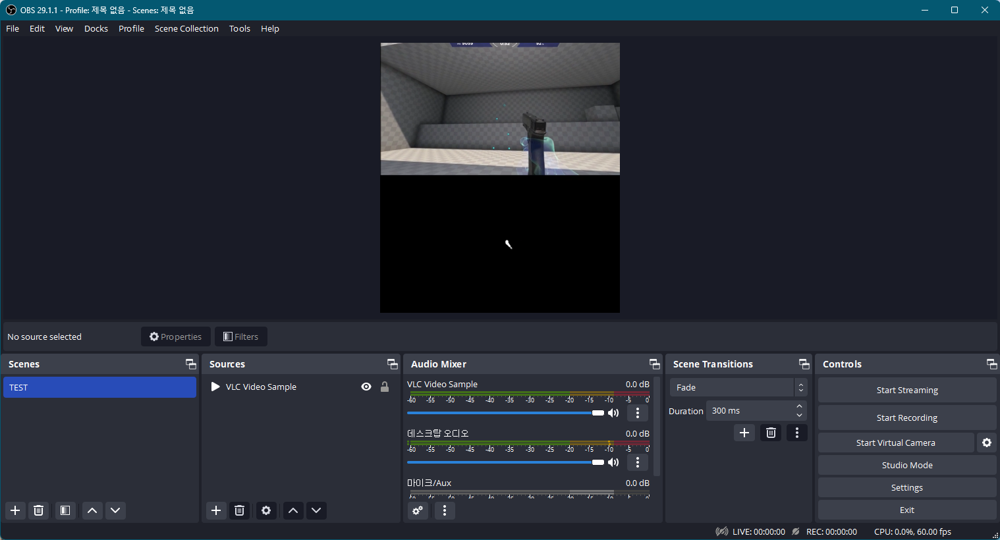
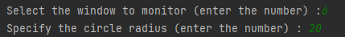
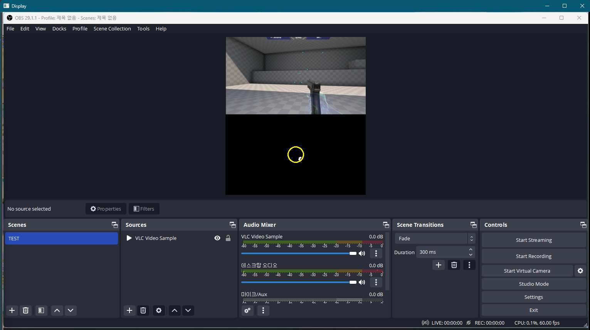
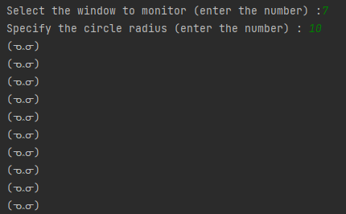

# Azusa Detector (ᓀ‸ᓂ)
## Coordinate tracking and optional circle judging

Windows / Python 3.12:
```powershell
py -3 -m venv .venv
.\.venv\Scripts\python.exe -m pip install -r requirements.txt
.\.venv\Scripts\python.exe main.py
```

- Use **Circle judging** in setup, the **Circle ON/OFF** button in the monitoring
  window, or **O** while that window is focused. The choice is saved in `config.json`.
- **ON** shows the circle and enables outside alerts and grading. **OFF** hides
  the circle and disables alerts/grading; position tracking and recording continue.
- **Position** is relative to the first valid detection. **Delta** compares the
  current valid detection with the previous valid detection. The first detection
  has position `(0, 0)` and no delta. Toggling the circle or recording does not reset
  these references; starting a new monitoring run does.
- Missing detections retain the last displayed values with a **NO DETECTION** label.
  For `A -> missing -> missing -> B`, the next delta is `B - A`. Missing CSV rows
  have blank coordinates/deltas, never invented zeroes. `Delta Time (s)` includes
  the gap between the two valid detections.
- Coordinates use original OBS capture pixels: right is +X, down is +Y. They are
  not game-world distances or pixels in the resized Display window.
- The detector uses the center of a white connected component anywhere in the
  black play area. It ignores components below 3 pixels, components larger than
  5% of the area, and ambiguous candidates when the largest is less than twice the
  size of the runner-up. These are simple noise filters, not a guarantee against
  all false detections; the existing white-dot-on-black OBS setup is still needed.
- **R** starts/stops CSV recording. Per-frame CSVs retain the original six columns
  and append detection status, circle mode, relative position, delta, and delta time.
  `sessions_v2.csv` stores total/detected/judged frame counts. Only valid detections
  with circle judging ON enter the grade denominator. No judged frames means **N/A**.
  Existing `sessions.csv` files are left intact.

Tests:
```powershell
.\.venv\Scripts\python.exe -m unittest discover -s tests -v
```

Q : quit<br>
R : record<br>
M : mute

pyinstaller --onefile --noconsole --add-data "alert.wav;." main.py
> pyinstaller --onefile --add-data "alert.wav;." main.py
## Version 0.0.1
[24.07.17]<br>
Library and threading usage has been changed.<br>
Convenience features such as background recording, circle size adjustment, and coordinate logging have been added.

1. <b>Improved screenshot capture speed</b> : Replaced pyautogui.screenshot() with mss.grab().
2. <b>Constant optimization</b> : Frequently used values have been designated as constants.
3. <b>Computation optimization</b> : Utilized NumPy array operations. 
4. <b>Threading improvement</b> : Sound playback function now runs directly in a thread & notifications only sound when the state changes (switching inside/outside the circle). 
5. <b>Default settings</b> : Set default values for 'Window/Radius' to the OBS window and 45. 
6. <b>Background recording feature</b> : Background screen recording is now possible. 
7. <b>Real-time circle size adjustment</b> : Adjust the circle size in real-time using the '+' and '-' keys while the program is running.
8. <b>Coordinate logging</b> : Records time and coordinate positions.

---

## Version 0.0.0
- One-hour prototype DEMO version
```
pip install opencv-python
pip install numpy
pip install pygetwindow
pip install pyautogui
```

### [Usage]
- Run after OBS setup is completed.
1. Select the screen to recognize (Enter the number)<br>- Detects a black box.<br> <br><br><br>
2. Specify the circle radius (Enter the number)<br>- Currently, you can manually enter the radius of the circle for testing. <br><br> <br><br><br><br>
3. If inside the black area and outside the yellow circle, display text and play a beep sound <br> 
4. Exit button: 'Q'
